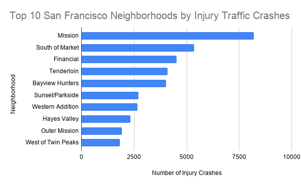
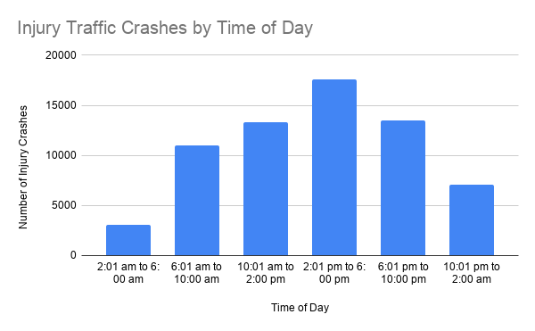

# Traffic Injury Crashes in San Francisco Cluster by Neighborhood and Time of Day

Traffic crashes are not evenly distributed across San Francisco. Some neighborhoods see far more reported injury crashes than others, and crashes also vary by time of day.

This project uses San Francisco’s open data on traffic crashes resulting in injury to examine where and when injury crashes happen most often. I focused on crashes by neighborhood and time of day to better understand which areas and time periods show the highest crash totals.

## Dataset Source 

Dataset source: [DataSF Traffic Crashes Resulting in Injury](https://data.sfgov.org/Public-Safety/Traffic-Crashes-Resulting-in-Injury/ubvf-ztfx/about_data)

The analysis makes use of the Traffic Crashes Resulting in Injury dataset provided through the San Francisco Open Data Portal (DataSF). It is important to mention that the dataset was not developed by the DataSF itself; rather, it consists of traffic collision data obtained from multiple sources – government agencies. Injury crash data for 2018 and later years is provided by the San Francisco Police Department's (SFPD) Interim Collision System, injury crash data for 2013-2017 is provided by Crossroads Software Traffic Collision Database, and injury crash data prior to 2013 is provided by the Statewide Integrated Transportation Record System (SWITRS) from the California Highway Patrol (CHP). Fatal crash data is checked through the San Francisco Office of the Chief Medical Examiner according to the San Francisco Vision Zero Fatality Protocol managed by the SFDPH, SFPD, and SFMTA.

The traffic collision data is collected in the California Highway Patrol 555 Traffic Collision Report. These documents are completed by police officers within 30 days of occurrence of an accident. After that, the data is programmatically extracted, de-identified, geocoded, and loaded into TransBASE, geospatial transportation safety database managed by the San Francisco Department of Public Health.
Since the data is generated by various government agencies through standardized reporting processes, it is usually a reliable resource to analyze reported injury traffic crashes in San Francisco. This dataset is gathered mainly for public safety, transportation planning, Vision Zero programs, and transparency. As it contains comprehensive information about the location of traffic crashes, the time when they occurred, weather, road features, and parties involved in the incidents, it forms an excellent basis for traffic safety trends analysis.

However, there are numerous limitations associated with this dataset that should be taken into account when analyzing the data and its outcomes. Firstly, the dataset only contains crashes that have been reported and documented by law enforcement, so those traffic accidents that have not been reported are not represented in the data. Also, the data only includes those crashes that have valid geographic coordinates and does not include crashes on highways. In complicated intersections involving several roads, traffic crashes are generalized as a single geographic location. Furthermore, there are missing "Not Stated" values in several variables.

This database is obtained from governmental sources, but the City of San Francisco mentions that it cannot assure the correctness or completeness of the database and does not recommend users to take responsibility for any findings derived from it. All administrative databases have certain limitations because they reflect the reporting style of the institutions that have gathered them. Finally, this database only reveals correlations and associations and not causations between variables. It is possible that certain areas have a greater number of injury crashes just because there is more traffic, more people living there, or more intersections, and those factors are not considered in the database.

## Data Analysis
Google Sheets analysis: [View my Google Sheet](https://docs.google.com/spreadsheets/d/1rCmXRXU0gwk-zFfVd4NhnsVEj0DdHeNLSPGs3UxQ0vQ/edit?usp=sharing)

The dataset was imported into Google Sheets, where I conducted the analysis using the spreadsheet skills covered in class. Before beginning the analysis, I reviewed the dataset to understand the available variables and identify categorical fields that could be summarized using pivot tables. Since each row represents a single injury traffic crash, I used the COUNT of unique_id as the value in each pivot table to calculate the total number of crashes for different categories.

To explore the data from multiple perspectives, I organized the dataset into four separate analyses using individual worksheet tabs:

- Neighborhood: summarized crashes by the analysis_neighborhood field.
- Time of Day: summarized crashes by the time_cat field.
- Day of Week: summarized crashes by the day_of_week field.
- Weather: summarized crashes by the weather_1 field.

This pivot table was individually designed for each analysis. The categorical data element was added into the Rows part of the pivot table, whereas COUNT of unique_id was added to the Values part. The next step was sorting the pivot tables in descending order in order to highlight categories with the largest number of injuries.

In addition to constructing pivot tables, visual representations of the results were created in order to make my findings more understandable. Two individual chart sheets called "Neighborhood Chart" and "Time of Day Chart" were created according to their respective pivot tables. The "Neighborhood Chart" uses the horizontal bar chart that compares ten neighborhoods with the largest number of injury crashes, whereas the "Time of Day Chart" uses the vertical column chart that compares crashes in six different time periods during a day.

Even though I have prepared pivot tables based on the variables such as Neighborhood, Time of Day, Day of Week, and Weather, but I have chosen Neighborhood and Time of Day variables to be included in visualizations since they provided me with the most significant and understandable findings. The reason why the Day of Week variable is not that illustrative is that it provides similar numbers of crashes on each weekday.

Examining the dataset with these four variables uncovered some interesting trends. The first major trend identified was the geographic one where relatively few neighborhoods had a higher frequency of traffic crashes involving injuries compared to other neighborhoods. Thus, the geographic variable was a good one to use for visualization purposes. There was also a peak during the afternoon period (2:01 pm – 6:00 pm), indicating that there is a pattern in injury crashes by time of day as they do not occur evenly across all periods. As for day of week, injury crashes appeared to be fairly similar in terms of their total numbers throughout all five weekdays. Finally, analyzing the weather variable, we can see that most injury crashes happen on clear days. Nevertheless, considering that in San Francisco, clear days predominate over severe weather days, the data may not necessarily indicate the latter being safer than the former.

For the final visualizations, I focused on two questions:

1. Which San Francisco neighborhoods had the most injury traffic crashes?
2. What time of day had the most injury traffic crashes?

## Finding 1: Injury crashes are concentrated in a small number of neighborhoods

**Figure 1.** The Mission had the highest number of reported injury traffic crashes in the dataset, followed by South of Market, the Financial District, Tenderloin, and Bayview Hunters Point. These areas may have higher crash totals because they include busy streets, commercial activity, and heavy vehicle, bicycle, and pedestrian traffic.

## Finding 2: Injury crashes peak in the afternoon

**Figure 2.** Injury traffic crashes were most common between 2:01 p.m. and 6:00 p.m., followed by the evening period from 6:01 p.m. to 10:00 p.m. Overnight hours had the fewest reported injury crashes.

## Ending Summary

This data calculates the total number of injury crashes in each of the categories. This does not assess the probability of a crash for any given driver, pedestrian, cyclist, or trip.

The first limitation in this regard is that neighborhoods that have more crashes might simply have higher volume of traffic, higher numbers of people, or more intersections. This database does not contain traffic volumes, pedestrian volumes, or bicycle counts to confirm that one area is more hazardous than another per capita.

Furthermore, this dataset also contains information about only those crashes which caused injuries and are reported. Not all types of traffic accidents are taken into account, but only those that cause injury and are reported. Some of the variables also contain missing values, "Not Stated," or unknown values.

This data might be misrepresented if crash counts are taken as the evidence that certain neighborhoods are more dangerous than others. Higher crash numbers might indicate higher traffic volumes rather than bad road design or dangerous activities. Complete story would require additional reporting and interviews.

The results indicate that traffic and urban density could be major factors in defining the time and place where crashes take place. Nevertheless, these facts alone do not reveal the reasons for their occurrence. It would be necessary to provide more information and reports regarding traffic intensity, road design, and pedestrians/cyclists' activity.

## Sources

- DataSF Open Data Portal, Traffic Crashes Resulting in Injury
- City and County of San Francisco
